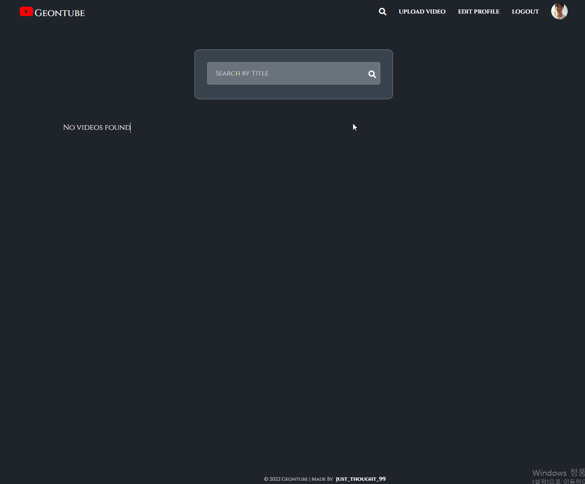

  <a href="https://new-videoplayer-nodejs.herokuapp.com">
    
      
    <a display="block" href="https://carrot-market-geon1999.vercel.app/">유튜브 클론</a>
  </a>

  

## Preview 

 

 #### 1. 홈

 

  
 

 

 

 #### 2. 소셜 로그인

 

  
 

 
  

  
 
#### 3. 비디오 재생 & 실시간 댓글

    
 
 임이 확인되면 만들어진 채팅룸으로 이동(data 안의 chatRoomId 를 통해 경로 설정) 
 
  

  
 

 
  

 

#### 4. 비디오 검색

  
 

  
 

 
  

 

 #### 5. 비디오 업로드

 

  
 

